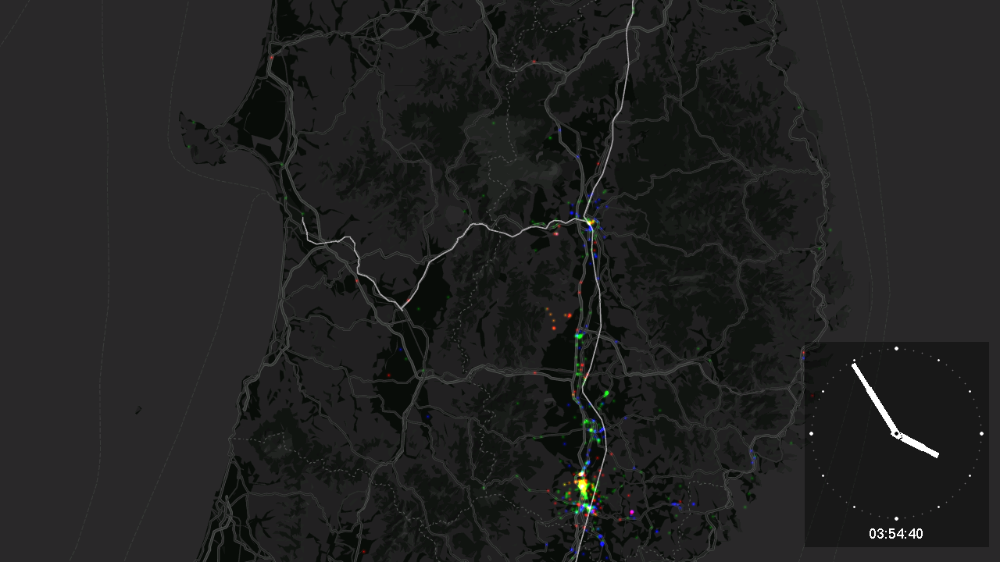

# MobmapNativeWin: Visualization Movement Data
An windows application tool for visualization and analysis of movement/trajectory data such as GPS/CDR. with its functionally, it supports large dataset.




## Prerequisites
* Ruby 2.6+ ([https://rubyinstaller.org](https://rubyinstaller.org))
* Google Map Token Key with static map enable
  ([https://developers.google.com/maps/documentation/javascript/get-api-key](https://developers.google.com/maps/documentation/javascript/get-api-key))

## Usage
1. Open "run.bat" and update Ruby path
```
:: [check and modify if required] *********************** ::
:: update path configuration of ruby                      ::
:: ****************************************************** ::
set PATH=%PATH%;C:\ruby\Ruby26\bin
...
```
2.  In MobMapNativeWin\scripts\fetchBaseMap.rb, input your google token key
```
#!/var/ruby19/bin/ruby

API_BASE = "http://maps.google.co.jp/maps/api/staticmap?"
API_KEY  = "put your google token key"	# updated here
TILE_SIZE = 640
OVERLAP   = 48
DL_DIR   = "./temp"
OUT_DIR   = "./temp"
OUT_BASENAME = "basemap"
...
```
3.  In MobMapNativeWin\presets\preset\sample.json, update parameters
```
{
	"global": {
		"base-map": {                           ## Specify center of map for rendering
			"lat": 39.546412, 
			"lng": 140.822754,
			"zoom": 9                       ## Specify zoom level
		}, 

		"begin-time":  0,                       ## Specify start time in seconds
		"end-time":    86400,                   ## Specify end time in seconds
		"step":        40                       ## Specify moving step in seconds
	},
	
	"layers": [
		{
			"type": "MovingPoints",
			"source": "dataset/gps.csv",    ## Specify data for rendering
			"marker": "Color-Spot",
			"appearance": "spot",           ## spot, tail, tail+spot
			"color-rule": "user-specified"
		}
	]
}
```
4. Open command prompt (cmd) and goto program path, then run "run.bat"
```
C:\>cd \Test\MobMapNativeWin-full
C:\Test\MobMapNativeWin-full>run.bat

```
5. Output will be in path "MobMapNativeWin\out"
```
out\frames    ## output in PNG image of each frame
out\movies    ## output in mp4 created from image frames using ffmpeg
```

## Input File (CSV)

* The inpurt file must be in CSV format with comma separated.
* File must contain at least the following attributes.
    ```
    Object ID     : Positive Integer value
    Time          : “YYYY/MM/DD hh:mm:ss ” format need to be sort in time order
    Longitude     : Real decimal degree) in WGS84
    Latitude      : Real Number(decimal degree) in WGS84
    marker-color  : Color code in decimal notation
    ```
* No Header in file.


## Author
* **Satoshi Ueyama** :  A project researcher at Center for Spatial Information Science, University of Tokyo, Japan until Oct. 2019, will be a researcher at LocationMind Inc. from Nov. 2019.
In 2019 he obtained his Ph.D. in Engineering from the University of Tokyo. And he is interested in utilizing visualization and computer graphics in the field of geographic information.

* **Hiroshi KANASUGI** :  A project researcher at Center for Spatial Information Science, University of Tokyo.

## License

Free to use

## Acknowledgments

* [Shibasaki Lab](https://shiba.iis.u-tokyo.ac.jp), The University of Tokyo
* [Center for Spatial Information Science](http://www.csis.u-tokyo.ac.jp/en/), The University of Tokyo


